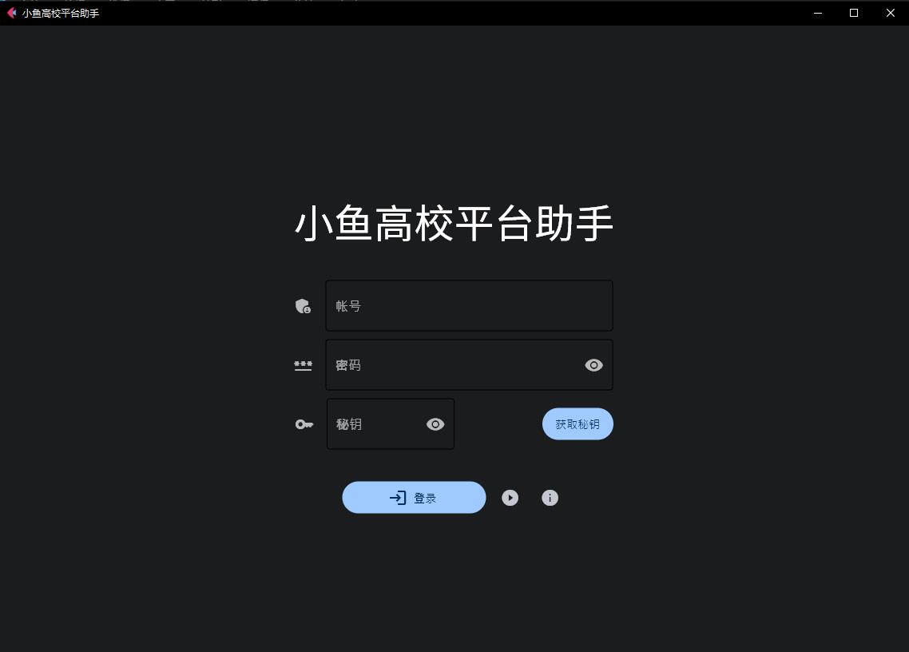

# 小鱼重庆高校在线刷课软件

#### 官网地址

+ [小鱼重庆高校助手（点击跳转）](https://mrkk1.github.io/)
  
#### 运行图片

 #### 支持平台
  - [x] Windows
  - [x] MacOS

#### 已有功能
  - [x] 自动观看课程
  - [x] 课程选择
  - [x] 自动跳过已完成章节
#### 待完善功能
  - [ ] 自动答题
      - [ ] 已过期题目作答（成绩可能无效，待测）
      - [ ] 复制另一个用户的答案自动作答

**注：自动观看课程中不会自动做题！但学习进度依旧会显示完成，请自行完成小节习题！**

#### 使用方法

+ [前往官网](https://mrkk1.github.io/)下载或者[点击这里](https://ixiaoyu.lanzoub.com/iA6KG0x8kgzi)获取V3.1.6.exe文件（不一定是最新版本，最新的前往官网）
+ 加入群聊获取秘钥
+ 在软件中输入高校平台的账号密码
+ 登陆后自动获取课程

#### 视频教程

+ [点击跳转](https://www.bilibili.com/video/BV1MY411d7iu/)

### 自动答题说明（正在开发）

+ 过期题目作答
  + 即自动作答已过期的题目
  + 提交后可能无分数，待测
+ 拷贝答案作答
  + 拷贝别人已作答题目的答案，来提交自己的

## 声明
+ **本软件基于MIT协议开源，请保留作者信息**
+ **所有用户信息仅在本地使用时离线存储，软件不会获取、上传、保留您的任何信息**
+ **欢迎大家提交Issue**
+ **脚本仅供学习交流，严禁用于商业用途！**
+ **刷课有风险， 请合理使用脚本。**
+ **由于平台官网原接口的修改，最新版本软件基于[Fuckcqooc](https://github.com/Fatpandac/fuck_cqooc)二次开发完成,引用到了[HUCKCQOOC](https://github.com/Fatpandac/hackcqooc)库，感谢作者[Fatpandac](https://github.com/Fatpandac)的开源支持**
